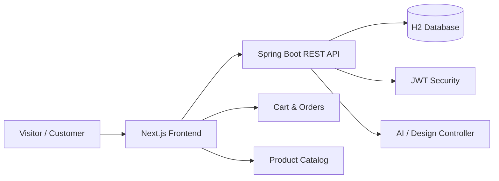

# ShopFlow

<div align="center">
  <svg width="980" height="220" viewBox="0 0 980 220" xmlns="http://www.w3.org/2000/svg" role="img" aria-label="ShopFlow logo">
    <defs>
      <linearGradient id="shopflowGradient" x1="0%" y1="0%" x2="100%" y2="0%">
        <stop offset="0%" stop-color="#FACC15" />
        <stop offset="35%" stop-color="#F59E0B" />
        <stop offset="65%" stop-color="#C084FC" />
        <stop offset="100%" stop-color="#60A5FA" />
      </linearGradient>
      <linearGradient id="shopflowGlow" x1="0%" y1="0%" x2="100%" y2="100%">
        <stop offset="0%" stop-color="#111827" />
        <stop offset="100%" stop-color="#0F172A" />
      </linearGradient>
    </defs>

    <rect x="20" y="25" width="940" height="170" rx="32" fill="url(#shopflowGlow)" stroke="rgba(255,255,255,0.12)"/>
    <circle cx="110" cy="110" r="52" fill="none" stroke="url(#shopflowGradient)" stroke-width="4" opacity="0.9"/>
    <path d="M87 140 L107 80 L126 140" fill="none" stroke="url(#shopflowGradient)" stroke-width="7" stroke-linecap="round" stroke-linejoin="round"/>
    <path d="M95 115 H118" stroke="url(#shopflowGradient)" stroke-width="7" stroke-linecap="round"/>

    <text x="470" y="110" text-anchor="middle" font-size="72" font-weight="900" font-family="Segoe UI, Arial, sans-serif" letter-spacing="6" fill="url(#shopflowGradient)">SHOPFLOW</text>
    <text x="470" y="148" text-anchor="middle" font-size="18" font-weight="600" font-family="Segoe UI, Arial, sans-serif" letter-spacing="7" fill="#CBD5E1">ART • BOOKS • DESIGN • SHOP</text>
  </svg>
</div>

[](https://www.oracle.com/java/)
[](https://spring.io/projects/spring-boot)
[](https://nextjs.org/)
[](https://react.dev/)

ShopFlow is a modern commerce and digital marketplace platform that blends artistic discovery, curated product browsing, and online shopping in a single experience. The project is split into two main parts:

- `backend/` — a Spring Boot REST API powered by Java, Spring Security, JPA, JWT, and H2
- `front/` — a Next.js storefront with a sleek interactive experience for browsing art, design, and books

This repository is designed as a full-stack application for product catalog management, authentication, shopping cart flows, order processing, and visual shopping experiences.

---

## Table of Contents

- [Overview](#overview)
- [Project Highlights](#project-highlights)
- [Architecture](#architecture)
- [Tech Stack](#tech-stack)
- [Repository Structure](#repository-structure)
- [Features](#features)
- [Getting Started](#getting-started)
- [Backend Setup](#backend-setup)
- [Frontend Setup](#frontend-setup)
- [Environment Configuration](#environment-configuration)
- [API & Documentation](#api--documentation)
- [Development Notes](#development-notes)
- [Roadmap](#roadmap)
- [Contributing](#contributing)
- [License](#license)

---

## Overview

ShopFlow is a marketplace experience centered around curated digital content and products:

- art collections
- graphic design pieces
- books and editorial content
- shopping cart and checkout flows
- user authentication
- product listing and detail browsing
- AI-assisted design and preview capabilities

The frontend is built for a visually rich storefront, with a themed landing experience and category-based browsing. The backend exposes services and endpoints that power catalog access, orders, cart state, chat/AI features, and security-driven access control.

---

## Project Highlights

- Full-stack marketplace monorepo
- Modern Java backend with Spring Boot
- Next.js frontend with client-side interactivity
- JWT-based authentication
- Product and order management APIs
- AI-enabled controller endpoints
- H2 database for local development
- Swagger/OpenAPI integration for backend API exploration
- Responsive storefront design

---

## Architecture



The system follows a classic client-server pattern:

- The frontend handles browsing, product display, cart interactions, and user navigation
- The backend manages domain entities, persistence, business logic, and authentication
- API contracts are designed around RESTful controllers for products, orders, users, books, carts, and AI services

---

## Tech Stack

### Frontend
- Next.js 16
- React 19
- JavaScript / JSX
- Tailwind CSS
- Axios
- js-cookie

### Backend
- Java 17
- Spring Boot 3.2
- Spring Web
- Spring Data JPA
- Spring Security
- Validation
- Lombok
- JWT (jjwt)
- H2 Database
- Springdoc OpenAPI

### Tooling
- Maven
- ESLint
- Git
- Swagger UI

---

## Repository Structure

```text
Shopflow-/
├── backend/
│   ├── .mvn/
│   ├── src/
│   │   ├── main/
│   │   │   ├── java/
│   │   │   │   └── com/
│   │   │   │       └── shopflow/
│   │   │   │           └── backend/
│   │   │   │               ├── controller/
│   │   │   │               ├── dto/
│   │   │   │               ├── entity/
│   │   │   │               ├── exception/
│   │   │   │               ├── repository/
│   │   │   │               ├── security/
│   │   │   │               ├── service/
│   │   │   │               └── BackendApplication.java
│   │   │   └── resources/
│   │   │       └── application.properties
│   │   └── test/
│   ├── pom.xml
│   ├── mvnw
│   ├── mvnw.cmd
│   ├── shopflowdb.mv.db
│   └── shopflowdb.trace.db
│
├── front/
│   ├── public/
│   ├── src/
│   │   ├── app/
│   │   │   ├── artist/
│   │   │   ├── books/
│   │   │   ├── cart/
│   │   │   ├── components/
│   │   │   ├── lib/
│   │   │   ├── login/
│   │   │   ├── order/
│   │   │   ├── orders/
│   │   │   ├── products/
│   │   │   ├── globals.css
│   │   │   ├── layout.js
│   │   │   └── page.js
│   ├── package.json
│   ├── package-lock.json
│   ├── next.config.mjs
│   ├── postcss.config.mjs
│   └── README.md
│
├── .gitignore
├── README.md
└── LICENSE (if present)
```

---

## Features

### Storefront Experience
- immersive homepage with category switching
- visual hero slideshow
- art and books browsing modes
- curated collections and featured products
- user-friendly card layouts with discount and pricing data

### Catalog & Product Management
- product retrieval endpoints
- category-based filtering
- product detail flows
- images and metadata support
- support for books, design, and art categories

### Cart & Orders
- cart management
- order creation and processing
- user order tracking
- checkout-ready backend orchestration

### Authentication & Authorization
- user sign-in and role support
- JWT security
- protected routes and secured endpoints
- backend security configuration with bearer token support

### AI / Design Support
- AI-related controller endpoints for creative or smart interactions
- design preview integration hooks
- support for enhanced product discovery and creative workflows

### API Layer
- OpenAPI documentation with Swagger UI
- endpoint discovery and testing without external tools
- developer-friendly API boundary

---

## Getting Started

### Prerequisites

Before running the project locally, make sure you have:

- Java 17+
- Maven 3.8+
- Node.js 18+
- npm or pnpm
- Git

---

## Backend Setup

Navigate to the backend directory:

```bash
cd backend
```

Run the application:

```bash
./mvnw spring-boot:run
```

On Windows:

```bash
mvnw.cmd spring-boot:run
```

The backend will run with the default Spring Boot configuration and use the embedded H2 database for local development.

### Useful backend commands

```bash
./mvnw test
./mvnw clean package
```

### API documentation

Once the backend is running, open:

```text
http://localhost:8080/swagger-ui/index.html
```

This project includes Springdoc OpenAPI integration, making it easy to test and inspect the REST API.

---

## Frontend Setup

Navigate to the frontend directory:

```bash
cd front
```

Install dependencies:

```bash
npm install
```

Start the development server:

```bash
npm run dev
```

Then open:

```text
http://localhost:3000
```

### Frontend scripts

```bash
npm run dev
npm run build
npm run start
npm run lint
```

---

## Environment Configuration

The backend configuration is defined in:

```text
backend/src/main/resources/application.properties
```

This file contains settings relevant to the Spring Boot app, including database and application configuration.

The frontend is configured to be used as a standalone Next.js application and is designed for local development with the backend running on the default Spring port.

Typical local configuration:

- Frontend: `http://localhost:3000`
- Backend API: `http://localhost:8080`

If needed, update your frontend API base URL in the relevant API helper file under:

```text
front/src/app/lib/
```

---

## API & Documentation

The backend exposes endpoints for:

- authentication
- products
- books
- cart
- orders
- AI/design preview
- user interaction and commerce flows

The project uses Swagger/OpenAPI for documentation, which is especially helpful when inspecting request/response models and validating integration.

Open API docs here:

```text
http://localhost:8080/swagger-ui/index.html
```

---

## Development Notes

### Backend design
The backend follows a layered structure:

- `controller` — handles incoming HTTP requests
- `service` — business logic
- `repository` — persistence access
- `entity` — domain models
- `dto` — data transfer objects
- `security` — authentication and JWT configuration
- `exception` — error handling

### Frontend design
The frontend is built around the `src/app` structure and uses a highly visual landing-page design pattern to mimic a premium storefront. The app includes:

- responsive styling
- theme/mode switching
- category navigation
- product cards
- cart triggers
- streamlined user flows

---

## Roadmap

Planned improvements could include:

- real database migration setup
- production environment configuration
- payment integration
- admin dashboard
- order analytics
- improved AI product discovery
- stronger user role management
- deployment automation using Docker / CI/CD

---

## Contributing

Contributions are welcome.

1. Fork the repository
2. Create a feature branch
3. Commit your changes
4. Open a pull request

Before submitting changes, run:

```bash
cd backend && ./mvnw test
cd front && npm run lint
```

---

## License

This project currently does not appear to declare a specific license in the repository metadata, so you should confirm the licensing terms before publishing or distributing it commercially.

If you want, you can add a license file such as MIT or Apache 2.0.

---

## Final Note

ShopFlow is a strong full-stack e-commerce and creative marketplace prototype with a polished storefront and a well-structured backend. It combines visual merchandising, product catalog behavior, order logic, and modern application architecture in a single monorepo, making it a solid foundation for a real-world commerce platform.

If you want, I can also generate:
- a cleaner GitHub-ready version with badges and screenshots placeholders
- a more premium “startup pitch” README
- a shorter version optimized for GitHub profile/repo presentation
- a README tailored specifically for a portfolio or coursework submission
